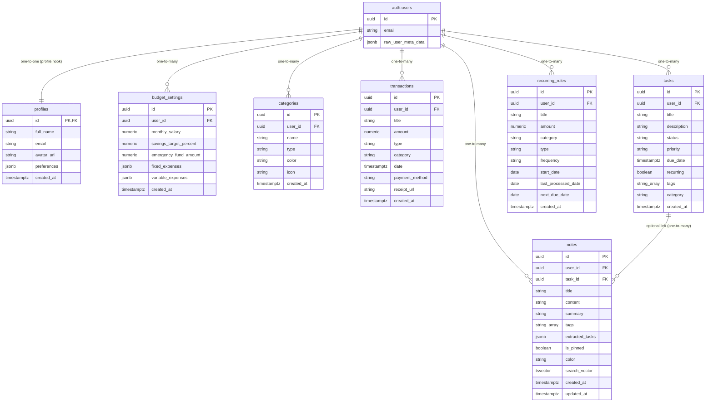

# Backend Database Schema & Stored Procedures Specification

This document presents a comprehensive analysis and mapping of the backend architecture for **FinanceTask (Toffee)**. The backend is powered by **Supabase (PostgreSQL)**, utilising row-level security (RLS), custom trigger functions, stored database routines (PL/pgSQL), full-text search indexing, and secure object storage buckets.

---

## 🗺️ Architectural & Database Schema Map

The relationship between the tables, authentication objects, and triggers is mapped below:



---

## 🗃️ 1. Relational Database Tables

Below is the detailed specification of the PostgreSQL tables, including default values, constraints, and Row Level Security (RLS) configurations.

### 1.1 Table: `profiles`
Holds general user details linked to the internal Supabase auth model.
* **Columns**:
  * `id`: `uuid` (Primary Key, references `auth.users`)
  * `full_name`: `text` (Nullable)
  * `email`: `text` (Nullable)
  * `avatar_url`: `text` (Nullable)
  * `preferences`: `jsonb` (Default: `'{}'::jsonb`)
  * `created_at`: `timestamptz` (Default: `now()`)
* **RLS Policies**:
  * *Select*: `auth.uid() = id` (User can read own profile)
  * *Insert*: `auth.uid() = id` (User can insert own profile)
  * *Update*: `auth.uid() = id` (User can update own profile)

### 1.2 Table: `budget_settings`
Configures monthly salary constraints, targets, and sets list of fixed & variable expenses.
* **Columns**:
  * `id`: `uuid` (Primary Key, Default: `gen_random_uuid()`)
  * `user_id`: `uuid` (References `auth.users`, Not Null)
  * `monthly_salary`: `numeric` (Default: `0`)
  * `savings_target_percent`: `numeric` (Default: `20`)
  * `emergency_fund_amount`: `numeric` (Default: `0`)
  * `fixed_expenses`: `jsonb` (Default: `'[]'::jsonb`)
  * `variable_expenses`: `jsonb` (Default: `'[]'::jsonb`)
  * `created_at`: `timestamptz` (Default: `now()`)
* **RLS Policies**:
  * *Select*: `auth.uid() = user_id`
  * *Insert*: `auth.uid() = user_id`
  * *Update*: `auth.uid() = user_id`

### 1.3 Table: `categories`
Categories used to organize financial transactions.
* **Columns**:
  * `id`: `uuid` (Primary Key, Default: `gen_random_uuid()`)
  * `user_id`: `uuid` (References `auth.users`, Not Null)
  * `name`: `text` (Not Null)
  * `type`: `text` (E.g. `"fixed"`, `"variable"`, `"income"`)
  * `color`: `text` (Hex code or CSS variable color class)
  * `icon`: `text` (Lucide icon identifier string)
  * `created_at`: `timestamptz` (Default: `now()`)
* **RLS Policies**:
  * *Select / Insert / Update / Delete*: `auth.uid() = user_id`

### 1.4 Table: `transactions`
Contains transaction records representing expenses or income.
* **Columns**:
  * `id`: `uuid` (Primary Key, Default: `gen_random_uuid()`)
  * `user_id`: `uuid` (References `auth.users`, Not Null)
  * `title`: `text` (Not Null)
  * `amount`: `numeric` (Not Null)
  * `type`: `text` (Not Null, E.g. `"income"`, `"expense"`)
  * `category`: `text` (Matches `name` in `categories`)
  * `date`: `timestamptz` (Default: `now()`)
  * `payment_method`: `text` (Nullable, E.g., `"Cash"`, `"Credit Card"`)
  * `receipt_url`: `text` (Pointer to storage bucket file object)
  * `created_at`: `timestamptz` (Default: `now()`)
* **RLS Policies**:
  * *Select / Insert / Update / Delete*: `auth.uid() = user_id`

### 1.5 Table: `tasks`
Stores items that need completion or tracking.
* **Columns**:
  * `id`: `uuid` (Primary Key, Default: `gen_random_uuid()`)
  * `user_id`: `uuid` (References `auth.users`, Not Null)
  * `title`: `text` (Not Null)
  * `description`: `text` (Nullable)
  * `status`: `text` (Default: `'todo'`)
  * `priority`: `text` (Default: `'medium'`)
  * `due_date`: `timestamptz` (Nullable)
  * `recurring`: `boolean` (Default: `false`)
  * `tags`: `text[]` (Array of keywords)
  * `category`: `text` (Default: `'Personal'`)
  * `created_at`: `timestamptz` (Default: `now()`)
* **RLS Policies**:
  * *Select / Insert / Update / Delete*: `auth.uid() = user_id`

### 1.6 Table: `notes`
Rich notes with linked task functionality and full-text search capability.
* **Columns**:
  * `id`: `uuid` (Primary Key, Default: `gen_random_uuid()`)
  * `user_id`: `uuid` (References `auth.users`, Not Null)
  * `task_id`: `uuid` (References `public.tasks`, On Delete: `set null`)
  * `title`: `text` (Not Null)
  * `content`: `text` (Not Null)
  * `summary`: `text` (AI generated cached summary, Nullable)
  * `tags`: `text[]` (Default: `'{}'`)
  * `extracted_tasks`: `jsonb` (Default: `'[]'::jsonb`)
  * `is_pinned`: `boolean` (Default: `false`)
  * `color`: `text` (Default: `'default'`)
  * `search_vector`: `tsvector` (Automatically computed vector column)
  * `created_at`: `timestamptz` (Default: `now()`)
  * `updated_at`: `timestamptz` (Default: `now()`)
* **Indexes & Search Vectors**:
  * `search_vector` generated expression: `to_tsvector('english', coalesce(title, '') || ' ' || coalesce(content, ''))`
  * `notes_search_idx` index: `GIN(search_vector)` for fast indexing of text matches.
  * B-tree indexes for user lookup, task linking, pinned status, and dates:
    * `notes_user_id_idx` on `user_id`
    * `notes_task_id_idx` on `task_id`
    * `notes_created_at_idx` on `created_at DESC`
    * `notes_is_pinned_idx` on `is_pinned WHERE is_pinned = true`
* **RLS Policies**:
  * *Select / Insert / Update / Delete*: `auth.uid() = user_id`

### 1.7 Table: `recurring_rules`
Holds definitions of recurring rules for automatic transaction billing generation.
* **Columns**:
  * `id`: `uuid` (Primary Key, Default: `uuid_generate_v4()`)
  * `user_id`: `uuid` (References `auth.users`, Not Null)
  * `title`: `text` (Not Null)
  * `amount`: `numeric` (Not Null)
  * `category`: `text` (Not Null)
  * `type`: `text` (Constraints: `'income'` or `'expense'`, Not Null)
  * `frequency`: `text` (Constraints: `'weekly'`, `'monthly'`, or `'yearly'`, Not Null)
  * `start_date`: `date` (Not Null)
  * `last_processed_date`: `date` (Nullable)
  * `next_due_date`: `date` (Not Null)
  * `created_at`: `timestamptz` (Default: `now()`)
* **RLS Policies**:
  * *Select / Insert / Update / Delete*: `auth.uid() = user_id`

---

## ⚙️ 2. Stored Database Triggers

Triggers are implemented in the Postgres layer to handle actions automatically upon table manipulations.

### 2.1 Trigger: `on_auth_user_created`
* **Target Table**: `auth.users` (Insert event)
* **Function**: `public.handle_new_user()`
* **Purpose**: Automatically constructs and inserts a corresponding entry into `public.profiles` using registration credentials.
* **Source Code**:
  ```sql
  create or replace function public.handle_new_user()
  returns trigger as $$
  begin
    insert into public.profiles (id, full_name, email)
    values (new.id, new.raw_user_meta_data->>'full_name', new.email);
    return new;
  end;
  $$ language plpgsql security definer;
  ```

### 2.2 Trigger: `notes_updated_at_trigger`
* **Target Table**: `public.notes` (Update event)
* **Function**: `public.update_notes_updated_at()`
* **Purpose**: Updates the `updated_at` timestamp on updates.
* **Source Code**:
  ```sql
  create or replace function update_notes_updated_at()
  returns trigger as $$
  begin
    new.updated_at = now();
    return new;
  end;
  $$ language plpgsql;
  ```

---

## 🛠️ 3. Stored Database Functions (PL/pgSQL RPCs)

The database utilizes specific stored procedures to aggregate analytical metrics.

### 3.1 Function: `get_monthly_metrics`
* **Input Parameters**: `month_str text` (Expected first day of a month: `YYYY-MM-DD`)
* **Returns**: `jsonb`
* **Description**: Returns total income, expenses, and net savings for the target month.
* **Source Code**:
  ```sql
  create or replace function public.get_monthly_metrics(month_str text)
  returns jsonb as $$
  declare
    start_date timestamptz;
    end_date timestamptz;
    total_income numeric;
    total_expenses numeric;
    net_savings numeric;
  declare
    start_date := month_str::timestamptz;
    end_date := start_date + interval '1 month';

    select coalesce(sum(amount), 0) into total_income
    from public.transactions
    where user_id = auth.uid() and type = 'income' and date >= start_date and date < end_date;

    select coalesce(sum(amount), 0) into total_expenses
    from public.transactions
    where user_id = auth.uid() and type = 'expense' and date >= start_date and date < end_date;

    net_savings := total_income - total_expenses;

    return jsonb_build_object(
      'total_income', total_income,
      'total_expenses', total_expenses,
      'net_savings', net_savings
    );
  end;
  $$ language plpgsql security definer;
  ```

### 3.2 Function: `get_category_distribution`
* **Input Parameters**: `month_str text`
* **Returns Table**: `name text, value numeric, color text`
* **Description**: Sums transaction amounts per category name for the current month.
* **Source Code**:
  ```sql
  create or replace function public.get_category_distribution(month_str text)
  returns table (name text, value numeric, color text) as $$
  declare
    start_date timestamptz;
    end_date timestamptz;
  begin
    start_date := month_str::timestamptz;
    end_date := start_date + interval '1 month';

    return query
    select 
      t.category as name,
      sum(t.amount) as value,
      max(c.color) as color
    from public.transactions t
    left join public.categories c on t.category = c.name and c.user_id = auth.uid()
    where t.user_id = auth.uid() and t.type = 'expense' and t.date >= start_date and t.date < end_date
    group by t.category;
  end;
  $$ language plpgsql security definer;
  ```

### 3.3 Function: `get_spending_trend`
* **Input Parameters**: `month_str text`
* **Returns Table**: `day_label text, amount numeric`
* **Description**: Group daily transaction expenses chronologically to feed trend line charts.
* **Source Code**:
  ```sql
  create or replace function public.get_spending_trend(month_str text)
  returns table (day_label text, amount numeric) as $$
  declare
    start_date timestamptz;
    end_date timestamptz;
  begin
    start_date := month_str::timestamptz;
    end_date := start_date + interval '1 month';

    return query
    select 
      to_char(date, 'Mon DD') as day_label,
      sum(t.amount) as amount
    from public.transactions t
    where t.user_id = auth.uid() and t.type = 'expense' and t.date >= start_date and t.date < end_date
    group by to_char(date, 'Mon DD'), date::date
    order by date::date;
  end;
  $$ language plpgsql security definer;
  ```

### 3.4 Function: `process_recurring_transactions`
* **Input Parameters**: `p_user_id uuid`
* **Returns**: `void`
* **Description**: Checks for active recurring rules whose `next_due_date` is less than or equal to `current_date`. For each due occurrence, it generates a transaction entry inside `public.transactions` with title suffix `(Recurring)`. It then updates the rule's `last_processed_date` and shifts `next_due_date` by the rule's frequency interval (week, month, or year).
* **Source Code**:
  ```sql
  create or replace function process_recurring_transactions(p_user_id uuid)
  returns void as $$
  declare
    rule record;
    current_due_date date;
  begin
    for rule in 
      select * from public.recurring_rules 
      where user_id = p_user_id and next_due_date <= current_date
    loop
      current_due_date := rule.next_due_date;
      
      while current_due_date <= current_date loop
        insert into public.transactions (
          user_id, title, amount, category, type, date, created_at
        ) values (
          rule.user_id,
          rule.title || ' (Recurring)',
          rule.amount,
          rule.category,
          rule.type,
          to_char(current_due_date, 'Mon DD, YYYY'),
          now()
        );
        
        if rule.frequency = 'weekly' then
          current_due_date := current_due_date + interval '1 week';
        elsif rule.frequency = 'monthly' then
          current_due_date := current_due_date + interval '1 month';
        elsif rule.frequency = 'yearly' then
          current_due_date := current_due_date + interval '1 year';
        end if;
      end loop;

      update public.recurring_rules
      set last_processed_date = current_date,
          next_due_date = current_due_date
      where id = rule.id;
    end loop;
  end;
  $$ language plpgsql security definer;
  ```

### 3.5 Function: `get_smart_insights`
* **Input Parameters**: `month_str text`
* **Returns**: `jsonb` (Includes array of insights objects: `{ type, title, message, category, ... }`)
* **Description**: Compares current spending to previous period.
  * **Insight 1 (Spending Alert)**: Scans for categories with a spending increase of > 10% compared to the previous month.
  * **Insight 2 (Savings Opportunity)**: Detects recurring expenses occurring at least 3 times in the last 3 months in specific categories (`'Entertainment'`, `'Subscriptions'`, `'Utilities'`, or `'Software'`).
  * **Insight 3 (Budget Health Check)**: Warns when current month's expenses exceed 90% of income, or provides a positive insight when expenses remain below 70% of income.
  * **Source Code Summary**: Compiles alerts in a `jsonb` array. If empty, inserts a default information note.

---

## 🛢️ 4. Storage Buckets configuration
* **Bucket ID**: `receipts`
* **Scope**: Authenticated users can upload and view receipts in folders matching their client UUID.
* **RLS Policies**:
  * `bucket_id = 'receipts' AND auth.uid() = owner` for SELECT, UPDATE, DELETE actions.
  * `bucket_id = 'receipts' AND auth.role() = 'authenticated'` for INSERT action.
