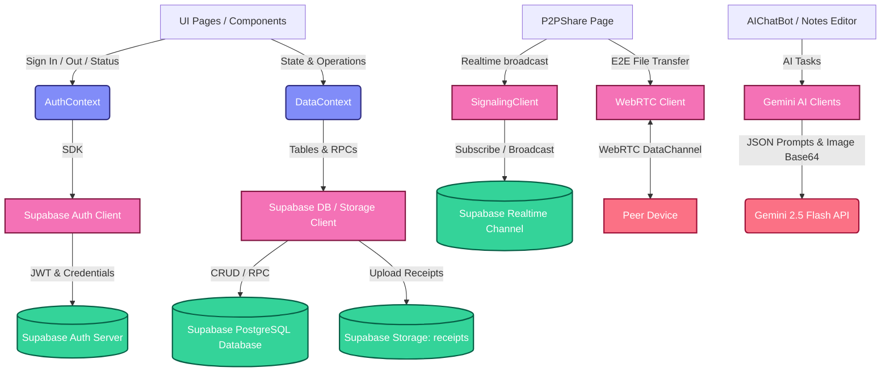
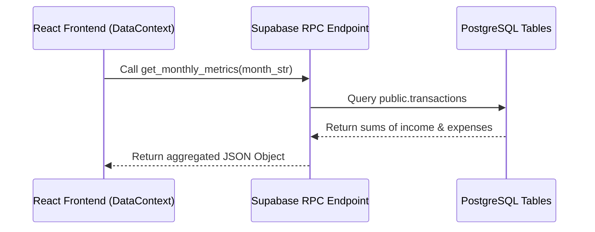
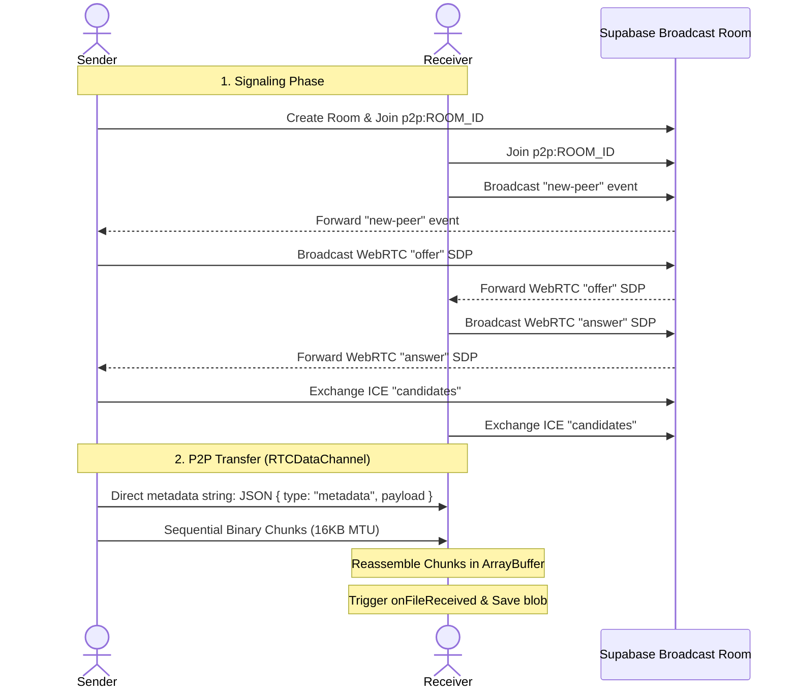

# Frontend Data Flow & API Specification Map

This document presents a comprehensive data flow and API mapping of the React frontend application for **FinanceTask (Toffee)**. It outlines the application architecture, details how data flows through React contexts and P2P layers, and documents every database table, RPC function, and AI service API call.

---

## 🗺️ Architectural Overview & Data Flow Map

The frontend is built on **React** and structured as a single-page application using **HashRouter**. Global state, authentication, and core database interactions are handled via two React contexts: [AuthContext.tsx](file:///d:/Chitrarth/Project%20P/FinanceTask/frontend/contexts/AuthContext.tsx) and [DataContext.tsx](file:///d:/Chitrarth/Project%20P/FinanceTask/frontend/contexts/DataContext.tsx). 

The flow between components, contexts, database tables, and external APIs is represented in the diagram below:



---

## 🔒 1. Authentication (Supabase Auth)

Authentication state is initialized and propagated throughout the app by the [AuthContext.tsx](file:///d:/Chitrarth/Project%20P/FinanceTask/frontend/contexts/AuthContext.tsx) context. It wraps the Supabase SDK's auth namespace.

### **Session Retrieval**
* **Method**: `supabase.auth.getSession()`
* **Event Listener**: `supabase.auth.onAuthStateChange(callback)`
* **Output / State Exposed**:
  * `session`: `Session | null`
  * `user`: `User | null`
  * `loading`: `boolean`

### **Sign In**
* **Method**: `supabase.auth.signInWithPassword(credentials)`
* **Input Body**:
  ```typescript
  {
    email: "user@example.com",
    password: "securepassword"
  }
  ```
* **Response**: `{ data: { user: User, session: Session }, error: null }`

### **Sign Up**
* **Method**: `supabase.auth.signUp(payload)`
* **Input Body**:
  ```typescript
  {
    email: "user@example.com",
    password: "securepassword",
    options: {
      data: {
        full_name: "username" // Extracted from email prefix
      }
    }
  }
  ```
* **Response**: `{ data: { user: User, session: Session }, error: null }`

---

## 📊 2. Database APIs & Schemas (Supabase Database)

All database transactions, operations, and listings are mapped directly using the Supabase client SDK inside [DataContext.tsx](file:///d:/Chitrarth/Project%20P/FinanceTask/frontend/contexts/DataContext.tsx). Below is the listing of tables, queries, inputs (Request Bodies), and outputs (Return Schemas).

### 2.1 Table: `profiles`
Stores settings and profile details.
* **Get Profile**:
  * *Query*: `.from("profiles").select("*").eq("id", user.id).single()`
* **Update Profile**:
  * *Query*: `.from("profiles").update(body).eq("id", user.id)`
  * *Request Body*:
    ```typescript
    {
      full_name?: string,
      avatar_url?: string,
      preferences?: Record<string, any> // jsonb field
    }
    ```

### 2.2 Table: `budget_settings`
Handles basic monthly limits, emergency funds, and fixed/variable expenses allocations.
* **Get Settings**:
  * *Query*: `.from("budget_settings").select("*").eq("user_id", user.id).maybeSingle()`
  * *Output Schema*:
    ```typescript
    {
      id: "uuid",
      user_id: "uuid",
      monthly_salary: number,
      savings_target_percent: number,
      emergency_fund_amount: number,
      fixed_expenses: Array<{ id: string, name: string, amount: number }>,
      variable_expenses: Array<{ id: string, name: string, amount: number }>,
      created_at: string
    }
    ```
* **Insert Initial Settings**:
  * *Query*: `.from("budget_settings").insert({ user_id: user.id, monthly_salary: 0, fixed_expenses: [], variable_expenses: [] }).select().single()`
* **Update Settings**:
  * *Query*: `.from("budget_settings").update(body).eq("id", budget_settings_id)`
  * *Request Body*:
    ```typescript
    {
      monthly_salary?: number,
      savings_target_percent?: number,
      emergency_fund_amount?: number,
      fixed_expenses?: Array<{ id: string, name: string, amount: number }>,
      variable_expenses?: Array<{ id: string, name: string, amount: number }>
    }
    ```

### 2.3 Table: `categories`
Defines categories for expenses and income.
* **Get Categories**:
  * *Query*: `.from("categories").select("*").eq("user_id", user.id)`
* **Insert Category**:
  * *Query*: `.from("categories").insert(body).select().single()`
  * *Request Body*:
    ```typescript
    {
      user_id: "uuid",
      name: string,
      type: "fixed" | "variable" | "pocket" | "income",
      color: string,
      icon: string
    }
    ```
* **Update Category**:
  * *Query*: `.from("categories").update(body).eq("id", category_id)`
  * *Request Body*: Contains any field from insertion schema.
* **Delete Category**:
  * *Query*: `.from("categories").delete().eq("id", category_id)`

### 2.4 Table: `transactions`
Contains records of individual user financial transactions.
* **Get Transactions List**:
  * *Query*: `.from("transactions").select("*").eq("user_id", user.id).order("date", { ascending: false })`
  * *Output Type (JSON Array)*:
    ```typescript
    Array<{
      id: "uuid",
      user_id: "uuid",
      title: string,
      amount: number,
      type: "income" | "expense",
      category: string,
      date: string, // ISO Timestamp
      payment_method?: string,
      receipt_url?: string,
      created_at: string
    }>
    ```
* **Insert Transaction**:
  * *Query*: `.from("transactions").insert(body)`
  * *Request Body*:
    ```typescript
    {
      id: "uuid",
      user_id: "uuid",
      title: string,
      amount: number,
      type: "income" | "expense",
      category: string,
      receipt_url?: string,
      date: string, // ISO String
      payment_method?: string
    }
    ```
* **Update Transaction**:
  * *Query*: `.from("transactions").update(body).eq("id", transaction_id)`
  * *Request Body*: Similar to Insert payload.
* **Delete Transaction**:
  * *Query*: `.from("transactions").delete().eq("id", transaction_id)`

### 2.5 Table: `tasks`
Stores personal and financial todos and reminders.
* **Get Tasks List**:
  * *Query*: `.from("tasks").select("*").eq("user_id", user.id).order("due_date", { ascending: true })`
* **Insert Task**:
  * *Query*: `.from("tasks").insert(body)`
  * *Request Body*:
    ```typescript
    {
      id: "uuid",
      user_id: "uuid",
      title: string,
      description?: string,
      status: "todo" | "in-progress" | "completed",
      priority: "low" | "medium" | "high",
      due_date?: string, // ISO timestamp
      recurring?: boolean,
      tags?: string[],
      category?: string
    }
    ```
* **Update Task Status**:
  * *Query*: `.from("tasks").update({ status }).eq("id", task_id)`
* **Delete Task**:
  * *Query*: `.from("tasks").delete().eq("id", task_id)`

### 2.6 Table: `notes`
Documents and plans containing details, AI summaries, taggings, and links to tasks.
* **Get Notes List**:
  * *Query*: `.from("notes").select("*").eq("user_id", user.id).order("is_pinned", { ascending: false }).order("updated_at", { ascending: false })`
* **Insert Note**:
  * *Query*: `.from("notes").insert(body)`
  * *Request Body*:
    ```typescript
    {
      id: "uuid",
      user_id: "uuid",
      task_id?: string, // Linked task UUID (Optional)
      title: string,
      content: string,
      summary?: string, // AI-generated summary string
      tags?: string[], // Suggested keywords
      extracted_tasks?: Array<{ title: string, priority: string, dueDate?: string, assignee?: string }>,
      is_pinned: boolean,
      color: string // "default", "red", "orange", etc.
    }
    ```
* **Update Note Content**:
  * *Query*: `.from("notes").update(body).eq("id", note_id)`
* **Pin / Unpin Note**:
  * *Query*: `.from("notes").update({ is_pinned: isPinned }).eq("id", note_id)`
* **Delete Note**:
  * *Query*: `.from("notes").delete().eq("id", note_id)`

### 2.7 Table: `recurring_rules`
Stores the rules for generating periodic/recurring transactions.
* **Insert Recurring Rule**:
  * *Query*: `.from("recurring_rules").insert(body)`
  * *Request Body*:
    ```typescript
    {
      user_id: "uuid",
      title: string,
      amount: number,
      category: string,
      type: "income" | "expense",
      frequency: "weekly" | "monthly" | "yearly",
      start_date: string, // YYYY-MM-DD
      next_due_date: string // YYYY-MM-DD (typically set to start_date initially)
    }
    ```

---

## 🛠️ 3. Supabase RPC Functions (Remote Procedure Calls)

The application utilizes custom PostgreSQL database RPC functions to aggregate metrics, run periodic background checks, and generate stats dynamically.



### 3.1 RPC: `get_monthly_metrics`
Aggregates total income, expenses, and net savings for the target month.
* **Signature**: `get_monthly_metrics(month_str: text)`
* **Argument**: `month_str` e.g., `"2026-08-01"`
* **Response Body**:
  ```json
  {
    "total_income": 5000.00,
    "total_expenses": 3420.50,
    "net_savings": 1579.50
  }
  ```

### 3.2 RPC: `get_category_distribution`
Returns categorized spending values and their matching colors for charts.
* **Signature**: `get_category_distribution(month_str: text)`
* **Argument**: `month_str` e.g., `"2026-08-01"`
* **Response Body (Table format converted to JSON Array)**:
  ```json
  [
    { "name": "Food", "value": 450.00, "color": "var(--chart-4)" },
    { "name": "Transport", "value": 120.00, "color": "var(--chart-1)" }
  ]
  ```

### 3.3 RPC: `get_spending_trend`
Returns chronological daily sums of expenses for trending line charts.
* **Signature**: `get_spending_trend(month_str: text)`
* **Argument**: `month_str` e.g., `"2026-08-01"`
* **Response Body (Table format converted to JSON Array)**:
  ```json
  [
    { "day_label": "Aug 01", "amount": 42.50 },
    { "day_label": "Aug 02", "amount": 105.00 }
  ]
  ```

### 3.4 RPC: `process_recurring_transactions`
Triggers periodic scanning and generation of any overdue recurring rules. Called in a `useEffect` whenever a session is loaded.
* **Signature**: `process_recurring_transactions(p_user_id: uuid)`
* **Argument**: `p_user_id` (current logged in user's ID)
* **Response**: `void`

### 3.5 RPC: `get_smart_insights`
Analyzes spending and compares it to previous months, detecting subscription patterns and budget overages.
* **Signature**: `get_smart_insights(month_str: text)`
* **Argument**: `month_str` e.g., `"2026-08-01"`
* **Response Body**:
  ```json
  {
    "insights": [
      {
        "type": "spending_alert",
        "title": "Spending Alert",
        "message": "You've spent 25% more on Food compared to last month. Current: $500 (Previously: $400). Consider reducing expenses in this category.",
        "category": "Food",
        "increase_pct": 25,
        "current_amount": 500,
        "previous_amount": 400
      }
    ]
  }
  ```

---

## 🛢️ 4. File Storage (Supabase Storage)

The app uploads paper receipts directly to a secure private bucket using the Supabase Storage API.

* **Bucket**: `'receipts'`
* **File Upload Path**: `owner_id/receipt_uuid` (Requires user to be authenticated)
* **API Details**:
  * *Upload*: `supabase.storage.from("receipts").upload(filePath, file)`
  * *Update*: `supabase.storage.from("receipts").update(filePath, file)`
  * *Delete*: `supabase.storage.from("receipts").remove([filePath])`

---

## 🤝 5. P2P Sharing Data Flow (Supabase Broadcast + WebRTC)

For secure room connections, signaling relies on **Supabase Broadcast Channels** (WebSockets), followed by **E2E direct binary/data streams via WebRTC RTCPeerConnection**.



### 5.1 Signaling Messages (Broadcast Channel: `p2p:ROOM_ID`)
* **Endpoint**: `supabase.channel('p2p:ROOM_ID')`
* **Broadcast Event**: `"signal"`
* **Payload Structure**:
  ```typescript
  {
    type: "new-peer" | "offer" | "answer" | "candidate",
    data: RTCSessionDescriptionInit | RTCIceCandidateInit | {},
    senderId: string // Random sender ID generated client-side
  }
  ```

### 5.2 WebRTC DataChannel Transfer (Direct Peer-to-Peer)
* **Binary Type**: `"arraybuffer"`
* **MTU Size**: `16KB` (`16 * 1024` bytes)
* **Buffer Backpressure Threshold**: `64KB` (`64 * 1024` bytes)
* **Packets Flow**:
  1. *Metadata message* (String JSON):
     ```json
     {
       "type": "metadata",
       "payload": {
         "name": "receipt.pdf",
         "size": 524288,
         "type": "application/pdf"
       }
     }
     ```
  2. *Binary Chunks* (ArrayBuffer): Loops of 16KB blocks yielded with a breathing loop layout to avoid UI lockups.

---

## 🤖 6. AI Integrations (Google Gemini API)

The application makes three categories of direct calls to Google's Gemini models using the developer API keys stored in `.env`.

### 6.1 Receipts Vision Parsing (`gemini-2.5-flash`)
Sends receipt images to extract structured parameters.
* **API / SDK Endpoint**: `@google/generative-ai` -> `gemini-2.5-flash` (`generateContent`)
* **Request Input**:
  * *Prompt text*: Ask to extract `merchantName`, `amount`, `date`, `category`, and `type` ("income" / "expense") as a raw JSON structure.
  * *Image part*: `{ inlineData: { data: base64MimeString, mimeType } }`
* **Response JSON Format**:
  ```json
  {
    "merchantName": "Starbucks",
    "amount": 5.75,
    "date": "2026-08-03T10:00:00Z",
    "category": "Food",
    "type": "expense"
  }
  ```

### 6.2 Copilot Chatbot Function Calling (`gemini-2.5-flash`)
Supports conversing with a financial assistant who can trigger actions locally using function parameters.
* **Endpoint**: `@google/generative-ai` -> `gemini-2.5-flash` (`generateContent`)
* **Context Payload**: Sent inside history header containing current `transactions`, `metrics`, `budgetSettings`, `tasks`, and `categories` as structured markdown.
* **Tools Declared**:
  1. `addTransaction` tool:
     * *Parameters*: `title` (string), `amount` (number), `category` (string), `type` ("expense" | "income"), `date` (string).
  2. `createTask` tool:
     * *Parameters*: `title` (string), `amount` (number), `dueDate` (string), `priority` ("low" | "medium" | "high").
* **Execution Flow**:
  1. User asks: *"Add coffee expense of $4 for today"*
  2. Gemini responds with a `functionCall` candidate.
  3. Frontend intercepts function request, runs local insert/add action, and maps success status response to Gemini.
  4. Gemini reads feedback and produces final textual greeting.

### 6.3 Smart Notes AIToolbar Actions (`gemini-2.5-flash`)
Raw text utilities for generating summaries, expanding sentences, formatting notes, and extracting lists.
* **HTTP Endpoint**: `https://generativelanguage.googleapis.com/v1beta/models/gemini-2.5-flash:generateContent?key=API_KEY`
* **Post Payload Format**:
  ```json
  {
    "contents": [
      {
        "parts": [{ "text": "PROMPT + Note Content" }]
      }
    ],
    "generationConfig": {
      "temperature": 0.7,
      "maxOutputTokens": 1024
    }
  }
  ```
* **Actions Prompts**:
  * **Summarize**: *"Summarize the following text into 3-5 concise key bullet points. Return only the bullet points, no introduction or conclusion."*
  * **Enhance**: *"Improve the following text by fixing any spelling mistakes, grammar errors, and enhancing clarity. Keep the same meaning and tone. Return only the improved text, nothing else."*
  * **Generate Tags**: *"Extract 3-5 relevant tags/keywords from the following text. Return them as a JSON array of lowercase strings, nothing else."*
  * **Extract Tasks**: *"Analyze the following text and extract any action items or tasks mentioned. Return them as a JSON array with objects containing: title (string), priority ("low", "medium", or "high"), and optionally assignee (string) if mentioned."*
  * **Expand**: *"Expand the following brief note into a more detailed and well-structured description. Add relevant context and details while keeping the original meaning."*
  * **Meeting Notes**: *"Format the following raw meeting notes into a well-structured format with: Meeting Summary, Key Discussion Points, Action Items, Decisions Made."*
  * **Detect Priority**: *"Analyze the following text and determine its urgency/priority level. Consider words like 'urgent', 'ASAP', 'deadline', 'critical'. Return only one word: 'low', 'medium', or 'high'."*
  * **Suggest Keywords**: *"Based on the following note content, suggest 3-5 related topics or keywords. Return as a JSON array of strings."*
