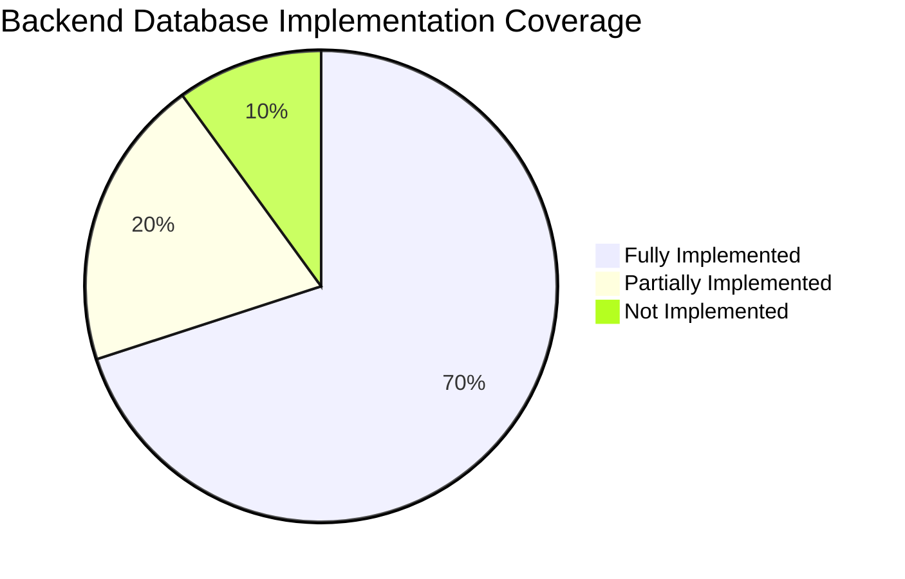
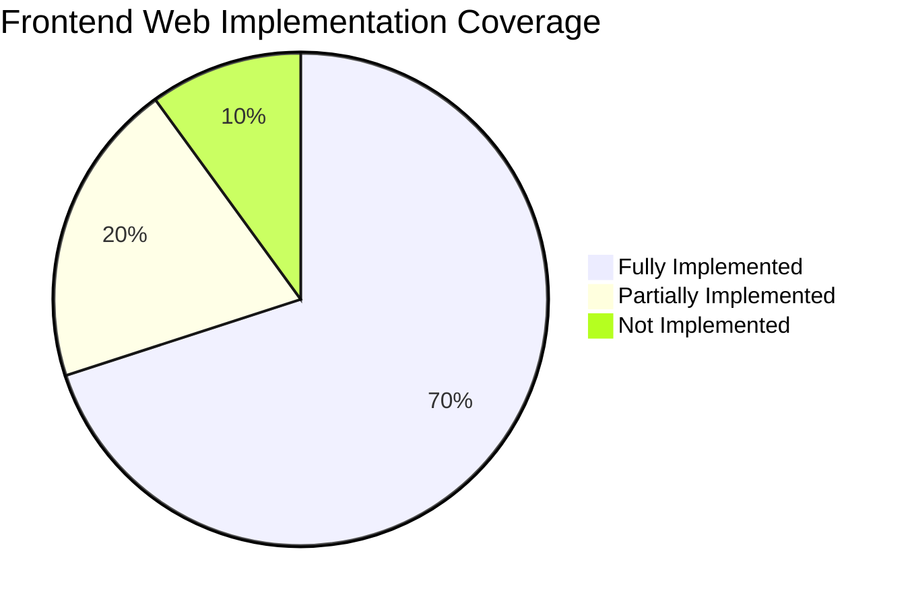
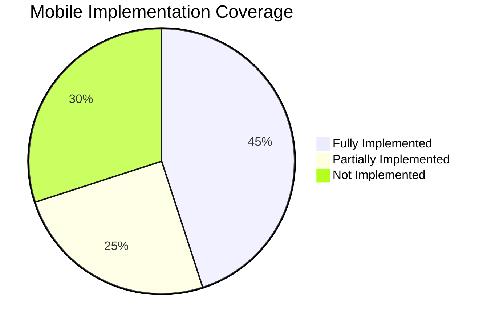

# Implementation Gap Analysis: PRD vs. Current Status

This document presents a comprehensive audit of the features implemented in the **FinanceTask (Toffee)** project compared to the requirements defined in [PRD-FinanceTask-v2.md](file:///d:/Chitrarth/Project%20P/FinanceTask/PRD-FinanceTask-v2.md). It highlights what is fully implemented, what is partially complete, and what remains pending (not implemented), grouped by **Backend**, **Frontend (Web)**, and **Mobile (React Native)**.

---

## 🗄️ 1. Backend / Database Layer (Supabase & PostgreSQL)

The database schema is defined in `backend/migrations/` and implements the relational data constraints, triggers, and RPC procedures.

### ✅ Fully Implemented
* **Relational Schema**: Tables for `profiles`, `budget_settings`, `categories`, `transactions`, `tasks`, `notes`, and `recurring_rules` are created in [20240101000000_init_schema.sql](file:///d:/Chitrarth/Project%20P/FinanceTask/backend/migrations/20240101000000_init_schema.sql) and [20240128000000_notes_schema.sql](file:///d:/Chitrarth/Project%20P/FinanceTask/backend/migrations/20240128000000_notes_schema.sql).
* **Row Level Security (RLS)**: Setup policies restrict reads/writes to `auth.uid() = user_id` or `auth.uid() = id` (e.g., [init_schema.sql:L12-14](file:///d:/Chitrarth/Project%20P/FinanceTask/backend/migrations/20240101000000_init_schema.sql#L12-L14) and [notes_schema.sql:L24-34](file:///d:/Chitrarth/Project%20P/FinanceTask/backend/migrations/20240128000000_notes_schema.sql#L24-L34)).
* **User Profile hook**: `public.handle_new_user()` trigger handles auth synchronization upon user registration ([init_schema.sql:L87-98](file:///d:/Chitrarth/Project%20P/FinanceTask/backend/migrations/20240101000000_init_schema.sql#L87-L98)).
* **Stored RPC Functions**: Stored functions compute metric aggregations (`get_monthly_metrics`), distributions (`get_category_distribution`), and trend charts (`get_spending_trend`) dynamically using PL/pgSQL routines ([20240101000001_analytics_functions.sql](file:///d:/Chitrarth/Project%20P/FinanceTask/backend/migrations/20240101000001_analytics_functions.sql)).
* **Full-Text Notes Index**: Generated expressions compute matching vectors in `notes` with a GIN index on `search_vector` ([notes_schema.sql:L55-59](file:///d:/Chitrarth/Project%20P/FinanceTask/backend/migrations/20240128000000_notes_schema.sql#L55-L59)).
* **Receipt Storage**: Configured storage bucket `'receipts'` with RLS rules for authenticated folder paths ([20240101000003_add_receipts_schema.sql](file:///d:/Chitrarth/Project%20P/FinanceTask/backend/migrations/20240101000003_add_receipts_schema.sql)).

### ⚠️ Partially Implemented

#### 📊 Database Schema Constraints
* **Categories Budget Limit**
  * *Code References*: [20240101000000_init_schema.sql:L33-L41](file:///d:/Chitrarth/Project%20P/FinanceTask/backend/migrations/20240101000000_init_schema.sql#L33-L41)
  * *Current State*: `categories` contains `id`, `user_id`, `name`, `type`, `color`, and `icon`.
  * *Gap*: Lacks a numeric `budget_limit` column. Setting category limit goals does not persist to database storage.
* **Historical Budget Snapshot Logging**
  * *Code References*: [20240101000000_init_schema.sql:L17-L26](file:///d:/Chitrarth/Project%20P/FinanceTask/backend/migrations/20240101000000_init_schema.sql#L17-L26)
  * *Current State*: `budget_settings` contains columns for net salary, savings target, emergency fund, and JSON fields for fixed/variable items.
  * *Gap*: No secondary logging tables exist. Overwriting salary or targets replaces the active monthly config, losing all historic months' allocations.

#### ⚙️ Background Routines & RPCs
* **Midnight Reset & Re-Calculations**
  * *Current State*: Client-side calculations dynamically divide the pool on load.
  * *Gap*: No database-level cron job or pgAgent task setup is scheduled. The database lacks any backend midnight recalculation job.
* **Insight Storage & Tracking**
  * *Code References*: [20240116000000_smart_insights_function.sql](file:///d:/Chitrarth/Project%20P/FinanceTask/backend/migrations/20240116000000_smart_insights_function.sql)
  * *Current State*: RPC dynamically queries the transaction ratios and outputs raw jsonb.
  * *Gap*: No insights/notifications logs are recorded in the database. Warnings cannot be marked as "seen" or reviewed later.
* **Inflexible Billing Cycles**
  * *Code References*: [20240101000001_analytics_functions.sql](file:///d:/Chitrarth/Project%20P/FinanceTask/backend/migrations/20240101000001_analytics_functions.sql#L15)
  * *Current State*: Queries explicitly cast `month_str` to `timestamptz` and compute `+ interval '1 month'`.
  * *Gap*: Hardcoded day-1 monthly starting ranges cannot adapt to custom billing periods or mid-month salary schedules.

### ❌ Not Implemented / Missing
* **Tasks "Not Done" Column & Reason Logging**
  * *Code References*: [20240101000000_init_schema.sql:L68-L79](file:///d:/Chitrarth/Project%20P/FinanceTask/backend/migrations/20240101000000_init_schema.sql#L68-L79)
  * *Current State*: `tasks` status defaults to `'todo'`.
  * *Gap*: There is no schema validation for `'Not Done'` status, no `reason_not_done` text field, and no `completion_time` timestamp.
* **Alarms & Notification Logs Sync Tables**
  * *Current State*: No tables exist to store alarm records, notification states, or FCM push tokens.
  * *Gap*: The mobile notification history (retained for 30 days) and alarms configs are not mapped to any PostgreSQL database objects.

---

## 🖥️ 2. Web Application (React + TypeScript)

The web app is structured as a multi-page routing layout under `frontend/` using React Router.

### ✅ Fully Implemented
* **Auth Core Routing**: Setup in [App.tsx](file:///d:/Chitrarth/Project%20P/FinanceTask/frontend/App.tsx#L85-L120) with protected routes mapping Dashboard, Transactions, Tasks, Notes, Analytics, Reports, and Settings.
* **State Sync Context**: [DataContext.tsx](file:///d:/Chitrarth/Project%20P/FinanceTask/frontend/contexts/DataContext.tsx#L73-L301) handles fetching and state sync for notes, tasks, transactions, and categories with Supabase.
* **AI Receipt Scanning**: Integrated in [TransactionModal.tsx](file:///d:/Chitrarth/Project%20P/FinanceTask/frontend/components/TransactionModal.tsx#L351-L360) calling [parseReceiptImage](file:///d:/Chitrarth/Project%20P/FinanceTask/frontend/utils/gemini.ts#L19-L60) to parse amounts, dates, and categories.
* **AI Smart Notes Actions**: Actions like `summarize`, `enhance`, and `formatMeeting` are bound to [AIToolbar.tsx](file:///d:/Chitrarth/Project%20P/FinanceTask/frontend/components/notes/AIToolbar.tsx#L50-L105) which forwards content to [geminiService](file:///d:/Chitrarth/Project%20P/FinanceTask/frontend/lib/gemini.ts#L69-L286).
* **Gemini Chat Tool Execution**: [AIChatBot.tsx](file:///d:/Chitrarth/Project%20P/FinanceTask/frontend/components/AIChatBot.tsx#L57-L138) intercept loops execute `addTransaction` and `createTask` functions locally and return success logs back to [chatWithGemini](file:///d:/Chitrarth/Project%20P/FinanceTask/frontend/utils/geminiChat.ts#L111-L222).

### ⚠️ Partially Implemented

#### 💸 Money & Budget Logic
* **Salary Setup History Logs**
  * *Code References*: [Settings.tsx](file:///d:/Chitrarth/Project%20P/FinanceTask/frontend/pages/Settings.tsx#L102-L120) & [DataContext.tsx](file:///d:/Chitrarth/Project%20P/FinanceTask/frontend/contexts/DataContext.tsx#L545-L566)
  * *Current State*: Salary input is saved in `budget_settings` table.
  * *Gap*: No historical logging schema. Updating salary values overwrites previous settings instead of appending a new snapshot to a history table.
* **Category Limits & Threshold Warnings**
  * *Code References*: [Settings.tsx](file:///d:/Chitrarth/Project%20P/FinanceTask/frontend/pages/Settings.tsx#L494-L541) & [types.ts](file:///d:/Chitrarth/Project%20P/FinanceTask/frontend/types.ts#L70)
  * *Current State*: Client-side `Category` type specifies `budgetLimit?: number`.
  * *Gap*: The `categories` database table has no `budget_limit` column, the creation forms lack input fields for budget limits, and the calculation engine lacks triggers to throw warning banners at the 80% or 100% budget threshold.
* **Midnight Reset & Re-Calculations**
  * *Code References*: [DataContext.tsx](file:///d:/Chitrarth/Project%20P/FinanceTask/frontend/contexts/DataContext.tsx#L322-L442)
  * *Current State*: Daily pocket money allocation is calculated reactively in a `useEffect` loop on state updates.
  * *Gap*: No database scheduler/cron executes midnight reset increments. Calculations are delayed until the next user active browser initialization.
* **Undo Queue for Deletions**
  * *Code References*: [DataContext.tsx](file:///d:/Chitrarth/Project%20P/FinanceTask/frontend/contexts/DataContext.tsx#L500-L504) & [Tasks.tsx](file:///d:/Chitrarth/Project%20P/FinanceTask/frontend/pages/Tasks.tsx#L160-L165)
  * *Current State*: Clicking Delete triggers immediate API deletes (`supabase.from().delete()`).
  * *Gap*: The 5-minute undo mechanism is missing. Deletions occur immediately without any cache buffer or restore options.

#### 📋 Task Management & Kanban
* **Not Done Column & Reasons**
  * *Code References*: [Tasks.tsx](file:///d:/Chitrarth/Project%20P/FinanceTask/frontend/pages/Tasks.tsx#L492-L517) & [types.ts](file:///d:/Chitrarth/Project%20P/FinanceTask/frontend/types.ts#L28)
  * *Current State*: Kanban renders Columns for *To Do*, *In Progress*, and *Completed*.
  * *Gap*: The **Not Done** column is entirely absent from the board, forms, and filtering lists. There is no code implementation to store "Reason for Not Done" or "Completion Time" fields.
* **Interactive Calendar Rescheduling**
  * *Code References*: [Tasks.tsx](file:///d:/Chitrarth/Project%20P/FinanceTask/frontend/pages/Tasks.tsx#L658-L663)
  * *Current State*: Calendar loads task dates statically.
  * *Gap*: Rescheduling tasks by dragging card points on the calendar grid is not supported.

#### 📈 Analytics Exporters
* **Cumulative Velocity Chart Gradient**
  * *Code References*: [Analytics.tsx](file:///d:/Chitrarth/Project%20P/FinanceTask/frontend/pages/Analytics.tsx#L441-L507)
  * *Current State*: Recharts `AreaChart` renders trend values with a fixed blue gradient.
  * *Gap*: Dynamic fill color transitions (green/yellow/red) based on target budget threshold violations are not implemented.
* **Styled Report Exports**
  * *Code References*: [Reports.tsx](file:///d:/Chitrarth/Project%20P/FinanceTask/frontend/pages/Reports.tsx#L83-L94) & [Analytics.tsx](file:///d:/Chitrarth/Project%20P/FinanceTask/frontend/pages/Analytics.tsx#L123-L145)
  * *Current State*: Reports are printed using browser `window.print()` wrappers. Analytics triggers a basic CSV downloader.
  * *Gap*: Generating formatted PDF documents complete with inline charts, metrics widgets, and tables is missing.

### ❌ Not Implemented / Missing
* **Biometric Auth Setup & 2FA Configuration**
  * *Code References*: [Settings.tsx](file:///d:/Chitrarth/Project%20P/FinanceTask/frontend/pages/Settings.tsx#L606-L673)
  * *Current State*: Tab renders change password fields and account deletion buttons.
  * *Gap*: Two-Factor Authentication, SMS Whitelist configurations, active connected sessions lookup, and biometric setup toggles have no code support.

---

## 📱 3. Mobile Application (React Native + Expo)

The mobile application is situated in `mobile/` and uses Expo SDK.

### ✅ Fully Implemented
* **Bottom Tab & Routing**: Core routes mapping Dashboard, Transactions, Tasks, Notes, Analytics, Reports, AI Chat, and P2P Share are configured in [App.tsx](file:///d:/Chitrarth/Project%20P/FinanceTask/mobile/App.tsx#L55-L110).
* **Local Context State**: State variables and CRUD callbacks sync with Supabase tables in [DataContext.tsx](file:///d:/Chitrarth/Project%20P/FinanceTask/mobile/context/DataContext.tsx#L50-L280).
* **Mobile WebRTC Client**: Implemented in [MobileWebRTCClient.ts](file:///d:/Chitrarth/Project%20P/FinanceTask/mobile/lib/p2p/MobileWebRTCClient.ts#L30-L245) utilizing base64 packet translations via `expo-file-system` to exchange notes/tasks.
* **Smart AI Assistant Chat**: Taps [geminiChat.ts](file:///d:/Chitrarth/Project%20P/FinanceTask/mobile/utils/geminiChat.ts#L25-L125) to map conversational intents to functional DB inserts inside [ChatScreen.tsx](file:///d:/Chitrarth/Project%20P/FinanceTask/mobile/screens/ChatScreen.tsx#L54-L132).
* **AI Note Utilities**: Connects to the Gemini AI Toolbar functions for note editing inside [NoteEditor.tsx](file:///d:/Chitrarth/Project%20P/FinanceTask/mobile/components/notes/NoteEditor.tsx#L120-L165).

### ⚠️ Partially Implemented

#### 📋 Tasks Board & Gesture Kanban
* **Horizontal Swipe & Touch Drag-and-Drop Columns**
  * *Code References*: [TasksScreen.tsx](file:///d:/Chitrarth/Project%20P/FinanceTask/mobile/screens/TasksScreen.tsx#L338-L398)
  * *Current State*: The tasks page renders a FlatList of cards filterable by toggle headers for `'todo'`, `'in-progress'`, and `'completed'`.
  * *Gap*: Swipe-gesture column views (scrollable page indicators 1/4, 2/4), long-press touch-drag zones, drag-and-drop between columns, and context menu long-press interactions are completely missing.
* **Task "Not Done" Status & Resolution Forms**
  * *Code References*: [TasksScreen.tsx](file:///d:/Chitrarth/Project%20P/FinanceTask/mobile/screens/TasksScreen.tsx#L31-L32) & [AddTaskModal.tsx](file:///d:/Chitrarth/Project%20P/FinanceTask/mobile/components/AddTaskModal.tsx#L102-L135)
  * *Current State*: Standard To Do, In Progress, and Completed states exist.
  * *Gap*: No `"Not Done"` column or option exists on the layout. Setting a task as abandoned has no form prompting users for a reason.

#### 💸 Money Tracking & Receipts
* **Analytics Velocity and Comparison Trends**
  * *Code References*: [DashboardScreen.tsx](file:///d:/Chitrarth/Project%20P/FinanceTask/mobile/screens/DashboardScreen.tsx#L462-L479) & [AnalyticsScreen.tsx](file:///d:/Chitrarth/Project%20P/FinanceTask/mobile/screens/AnalyticsScreen.tsx#L110-L165)
  * *Current State*: Integrates `react-native-gifted-charts` for basic line trends.
  * *Gap*: Does not implement spending velocity area ranges or side-by-side month-over-month overlays.
* **Camera Receipts Image Sync**
  * *Code References*: [AddTransactionModal.tsx](file:///d:/Chitrarth/Project%20P/FinanceTask/mobile/components/AddTransactionModal.tsx#L140-L185)
  * *Current State*: Snapping triggers simulator camera mocks.
  * *Gap*: Direct file synchronization to the Supabase Storage receipts bucket is partially structured.

### ❌ Not Implemented / Missing
* **Automated Expense SMS Scraping (Critical Feature)**
  * *Current State*: There is zero code referencing SMS filters in the entire mobile folder.
  * *Gap*: SMS broadcast receivers are missing. There are no known bank short code patterns, keywords parsing filters, local SQLite databases to cache pending approvals, or UI review tabs.
* **Push Notifications & intrusive Alarms**
  * *Code References*: [SettingsScreen.tsx](file:///d:/Chitrarth/Project%20P/FinanceTask/mobile/screens/SettingsScreen.tsx#L141)
  * *Current State*: Switch is mock-rendered.
  * *Gap*: No Firebase Cloud Messaging (FCM) or Expo Notifications services are registered. Critical alert alarms that bypass silent modes, vibration patterns, custom tones, and quiet hours constraints have no code support.
* **Local Biometric FaceID / Fingerprint Setup**
  * *Code References*: [SecurityScreen.tsx](file:///d:/Chitrarth/Project%20P/FinanceTask/mobile/screens/SecurityScreen.tsx#L105-L162)
  * *Current State*: Form only supports manual password revisions.
  * *Gap*: Biometrics authentication has no code implementation.

