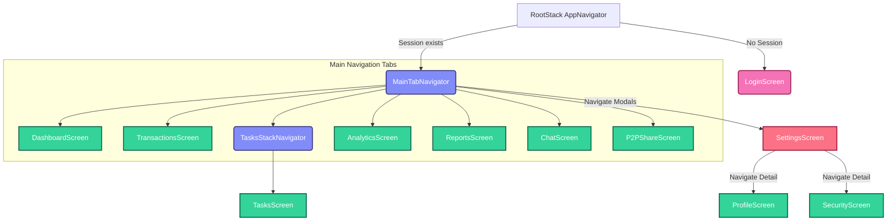
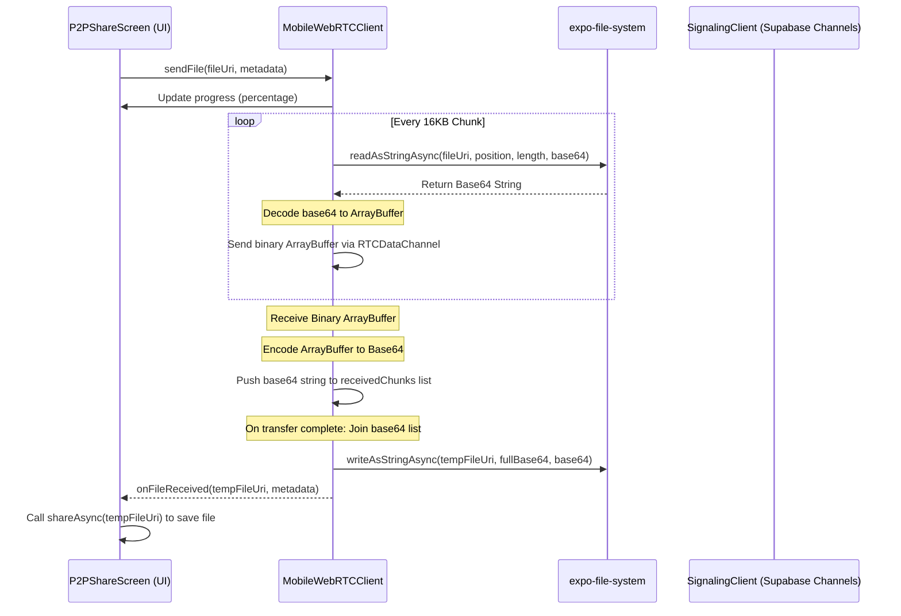

# Mobile App Data Flow & Navigation Specification Map

This document presents a comprehensive data flow, navigation, and API mapping of the **React Native / Expo** mobile application for **FinanceTask (Toffee)**. It outlines screen stacks, state orchestration, storage interaction, P2P file transfers, and AI model configurations.

---

## 🗺️ Architectural & Navigation Overview

The mobile application is powered by **Expo (React Native)**. It utilizes the `@react-navigation/native` system, combining a native bottom tab navigator with stack navigators to manage overlay flows. Global app configurations and states are coordinated by two React contexts: [AuthContext.tsx](file:///d:/Chitrarth/Project%20P/FinanceTask/mobile/context/AuthContext.tsx) and [DataContext.tsx](file:///d:/Chitrarth/Project%20P/FinanceTask/mobile/context/DataContext.tsx).

The diagrams below map the screen routing structure and data architecture:

### 1. Navigation Flow Map (Screens & Stacks)

---

## 🔒 1. Authentication (Supabase Auth in Mobile)

Like the frontend, [AuthContext.tsx](file:///d:/Chitrarth/Project%20P/FinanceTask/mobile/context/AuthContext.tsx) wraps the Supabase JS Auth SDK. In mobile, session lookup uses `@react-native-async-storage/async-storage` as the client key-value store to persist logins across app sessions.

* **API calls**:
  * `supabase.auth.getSession()` (Runs on startup)
  * `supabase.auth.onAuthStateChange(callback)` (Listens for token shifts)
  * `supabase.auth.signInWithPassword({ email, password })` (LoginScreen submit)
  * `supabase.auth.signUp({ email, password })` (Register submit)
  * `supabase.auth.signOut()` (Profile log out)

---

## 📊 2. Mobile Data State & Context APIs

State properties and CRUD functions are managed in [DataContext.tsx](file:///d:/Chitrarth/Project%20P/FinanceTask/mobile/context/DataContext.tsx). Data changes trigger re-rendering of screens like `DashboardScreen` and `TransactionsScreen`.

### **Custom Navigation State in Context**
To support responsive multi-device configurations in React Native, the context exposes the following navigation configuration variables:
* `navPosition`: `"bottom" | "top" | "left" | "right"` (Sets where the tab navigation renders)
* `isNavHidden`: `boolean`
* `isNavCollapsed`: `boolean`

### **Mobile DB Queries (Supabase SDK)**
* **Budget Settings Lookup**: `.from("budget_settings").select("*").eq("user_id", user.id).maybeSingle()`
* **Categories Lookup**: `.from("categories").select("*").eq("user_id", user.id)`
* **Transactions Listing**: `.from("transactions").select("*").eq("user_id", user.id).order("date", { ascending: false })`
* **Tasks Listing**: `.from("tasks").select("*").eq("user_id", user.id).order("due_date", { ascending: true })`
* **Notes Listing**: `.from("notes").select("*").eq("user_id", user.id).order("is_pinned", { ascending: false }).order("updated_at", { ascending: false })`

### **Calculated States (Derived Metrics)**
Every transaction add, update, or delete invokes a `useEffect` recalculation loop:
1. Calculates target salary and fixed expenses from `BudgetSettings`.
2. Computes the month's variable expenses by filtering `transactions` matching current month.
3. Computes target savings and determines the `pocketMoneyPool` (Income - Fixed - Variable - Savings Target).
4. Calculates `spentToday` by compiling today's transaction amounts.
5. Calculates `dailyLimit` = `(pocketMoneyPool - spentMonthTotal) / daysRemaining`.
6. Resolves `budgetHealth` (`"Healthy"` | `"At Risk"` | `"Critical"`).

---

## 🤝 3. Mobile P2P Sharing Implementation (WebRTC + Expo FS)

In React Native, standard browser WebRTC APIs are missing. P2P sharing instead utilizes the native bridge bindings inside `react-native-webrtc`.

### 3.1 MobileWebRTCClient (`mobile/lib/p2p/MobileWebRTCClient.ts`)
* **MTU Chunking**: `16KB`
* **Buffered Threshold**: `64KB` (Implements backpressure using `bufferedamountlow` event handler)
* **Base64 Translation**:
  * Uses `base64-arraybuffer` for encoding/decoding.
  * Reading files: `FileSystem.readAsStringAsync(fileUri, { encoding: 'base64', position, length })`
  * Writing files: `FileSystem.writeAsStringAsync(tempFileUri, joinedBase64, { encoding: 'base64' })`
* **Breathing yielding**: Unlike the browser's `async/await` while loop, mobile schedules chunks using `setTimeout(readAndSendChunk, 0)` to prevent blocking React Native's single JavaScript thread.

### 3.2 Signaling Clients (`mobile/lib/p2p/Signaling.ts`)
* Wraps Supabase broadcast channels. Sends `"offer"`, `"answer"`, and `"candidate"` payloads identical to the frontend system.

---

## 🤖 4. Mobile AI Integrations (Google Gemini API)

The mobile app integrates Gemini functions directly using Expo environment variables (`process.env.EXPO_PUBLIC_GEMINI_API_KEY`).

### 4.1 Receipt Scanner (`mobile/utils/gemini.ts`)
* **Trigger**: Click "Scan Receipt" in the `AddTransactionModal`.
* **Action**:
  1. Captures or picks an image to get local path `imageUri`.
  2. Reads file as base64: `FileSystem.readAsStringAsync(imageUri, { encoding: 'base64' })`
  3. Packages base64 into generative content request part: `{ inlineData: { data: base64, mimeType: "image/jpeg" } }`
  4. Prompt: Instructs Gemini to output JSON matching `{ merchantName, amount, date, category, type }`.
  5. Cleans markdown markers and parses JSON string.

### 4.2 Assistant Chat Screen (`mobile/screens/ChatScreen.tsx`)
* Implements a full screen chat page.
* Sends history array and user message.
* Runs a local tool-use interpreter loops on Gemini `functionCall` returns:
  * Intercepts `addTransaction` call -> triggers context's `addTransaction(args)`.
  * Intercepts `createTask` call -> triggers context's `addTask(args)`.
  * Forwards the action feedback object back to the chat model for final conversational verification.
